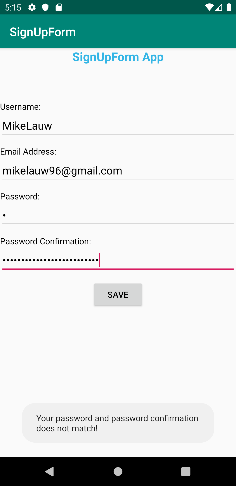

# SignUp Form

## Project Abstract
_The main goal of this project is to make a "registration form" with Android Studio.  The user will be forced to input
a username, email address, password, and password confirmation.  After filling their information, the user can click
the "Save" button and the message will appear to welcome them to the app.  However, there will be 2 criteria that needed to
be fulfilled to make the message appears.  The first one is the user has to fill all the fields that are displayed.
The second one is the password and password confirmation need to be the same text.  This application will also
show you a message telling you which criteria that has not been fulfilled when you try to click the button without 
meeting the criteria._ 

## Screenshots Showing the Toast and Final Screen

##There are some empty fields

##The password does not match

##Final Welcome Screen

